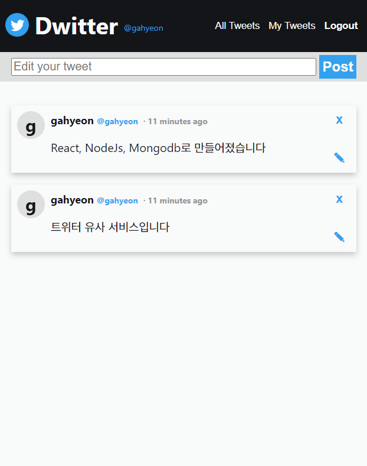
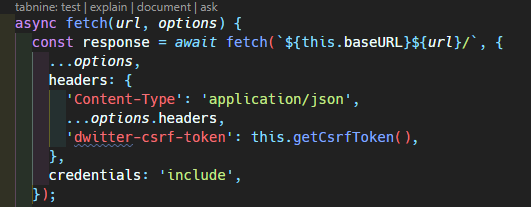
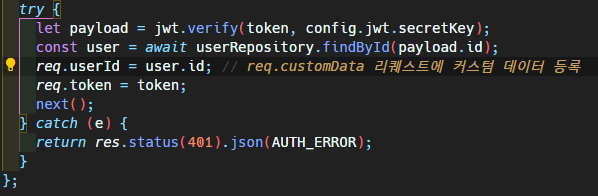
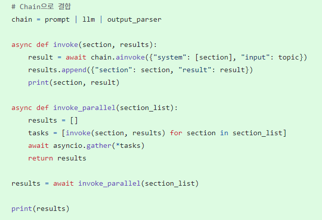
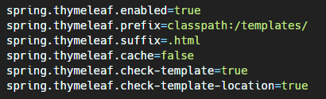
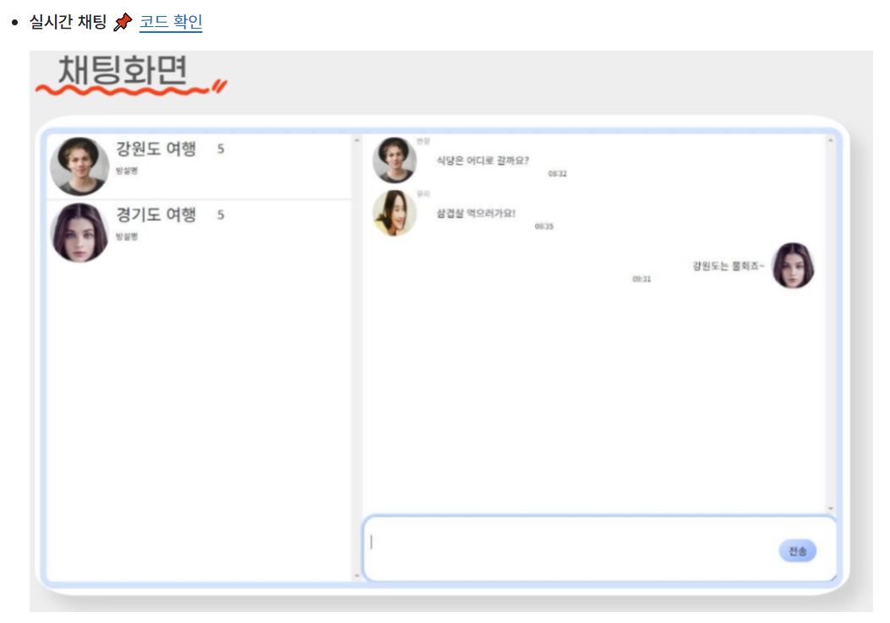
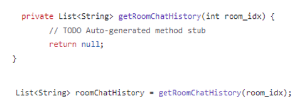

# 꾸준히 역량을 올리는 개발자

## Introduce

### Attitude

- 새로운 기술이나 도전에 대한 끊임없는 호기심과 탐구 정신과 긍정적인 마인드
- 문제 해결을 위한 논리적 접근 방식

 

## Stack

**[FrontEnd]**

    

**[BackEnd]**

      

**[CI/CD]**

CloudType   

**[ETC]**

  
   

## Project(solo)
- [2024.04.17 ~ 2024.05.17] **트위터 유사 서비스 < Dwitter >**
  - 예시 사진 :
  - 
  - 배포 링크 : [드위터](https://gahyeondwitter.netlify.app/)
  - 사용언어 :    
    사용 프레임워크 & 라이브러리 :     
    사용 API :   
    사용 DB :    
  

    
드위터 트러블 슈팅

   
  첫번째.  
  aws ec2로 서버를 배포하는 중에 환경변수가 인식되지 않는다는 에러가 계속 남.    
  .bash_profile 파일 내용을 cat이나 vim으로 확인했을땐 분명히 환경변수가 적혀있는데 $로 환경변수를 확인하면 나오지 않음.    

  해결 : 깜빡하고 환경변수를 입력한뒤 source 로 적용을 안시킴.. source .bash_profile 으로 해결.    

  두번째.   
  배포 후 메인페이지에서 다른 페이지로 넘어가면 404 에러가 남.  
  주소를 확인해보니 base url 뒤에 /가 하나 더 붙어있음.  
  react 프로젝트 내부에 http 관련 파일을 확인해보니 코드가 아래와 같이 되어있음.   

    

  url 뒤쪽의 /를 지워서 해결함.   

  세번째.  
  배포 후 사용자 인증 부분에서 에러가 나는 것을 확인함. 
  jwt 인증서는 잘 발급이 되는데 인증서에 있는 id를 이용해 유저를 찾는 부분에서 에러가 나는 것을 확인.  

    

  findById 부분에서 payload.userId가 아닌 그냥 id로 오타가 난 것을 발견함.  
  userId로 변경하여 해결.

  
  
     
  

## Project(team)
- [2024.03.15 ~ 2024.04.15] **교육기관용 프로젝트 기획서 생성 LLM 서비스 <써드림>**
  - 예시 사진 : 
  - 소개 링크 : [써드림](https://github.com/Gosegu2024/Surdream)
  - 배포 링크 : [써드림]()
  - 사용언어 :      
    사용 프레임워크 & 라이브러리 :      
    사용 API :    GPT4, LangChain  
    사용 DB : 
  - 맡은 역할 : 모든 웹페이지 제작 (html,css,js), Chart.js를 이용한 그래프 제작, springboot 백엔드 연결(thymeleaf 사용),mongodb 연동, 써드림 아웃풋 비동기 처리(python), aws와 docker를 통한 프로젝트 배포  
  

    
써드림 트러블 슈팅

   
  기획서를 생성하는 과정에서 사용자의 로딩 시간을 줄이기 위해 비동기로 각 항목이 나오게 해야하는 상황이 생김.  
  https://rfriend.tistory.com/844 해당 링크를 통해 Langchain의 비동기 함수 사용법을 배움.      

    

  다음과 같이 ainvoke, gather 등의 함수들을 이용해 해결함 해결함.

  
  
     
- [2024.03.15 ~ 2024.04.15] **웹사이트 기반 작문 LLM 서비스 평가•개선도구 <해드림>**
  - 예시 사진 : 
  - 소개 링크 : [해드림](https://github.com/Gosegu2024/Haedream)
  - 배포 링크 : [해드림]()
  - 사용언어 :      
    사용 프레임워크 & 라이브러리 :      
    사용 API :    GPT4, LangChain  
    사용 DB :   
  - 맡은 역할 : 모든 웹페이지 제작 (html,css,js), Chart.js를 이용한 그래프 제작, springboot 백엔드 연결(thymeleaf 사용),mongodb 연동, springboot 백엔드 연결, 써드림 아웃풋 비동기 처리(python), aws와 docker를 통한 프로젝트 배포  
  

    
해드림 트러블 슈팅

   
  thymeleaf 파일을 작성하고 동작하는지 확인하는 과정에서 404 에러가 나면서 동작하지 않는 문제가 생김.  
  dependency도 잘 설정해놓은 상태라 구글링을 통해 문제를 해결하려고 함.    
  서칭 결과 application.properties에 thymeleaf 설정을 추가하는 방법을 발견함.  

    

  다음과 같이 코드를 추가해 해결함.

  
  
     
- [2023.12.18 ~ 2024.01.24] **사용자 성향 조사 데이터를 활용한 혼행족을 겨냥한 여행 동행자 서비스 < 위드어스 >**
  - 예시 사진 : 
  - 소개 링크 : [위드어스](https://github.com/2023-SMHRD-IS-AI1/WithusRepo)
  - 사용언어 :     
    사용 프레임워크 & 라이브러리 : 전자정부프레임워크,   
    사용 DB : 
  - 맡은 역할 : 모든 웹페이지 제작 (html,css,js), 자바스크립트 웹소켓을 이용한 채팅 기능 구현, 발표 ppt 제작, 발표  
  

    
위드어스 트러블 슈팅

   
  자바스크립트 웹소켓을 사용해 채팅 기능을 구현하는 도중 메세지를 하나 보내고나면 웹소켓이 계속 닫히는것을 확인함.  
  코드를 보니 채팅 서버 컨트롤러에 null을 반환하는 함수가 호출 돼있어서 null값 때문에 오류가 나 웹소켓이 닫히는 것이었음.    

    

  이를 지워서 해결함.

  
  
     

## 보유 자격증

- 웹디자인 기능사
