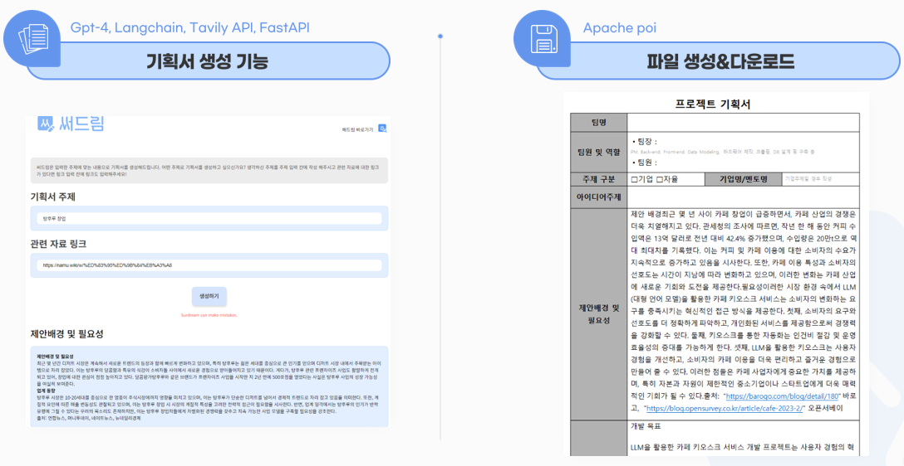
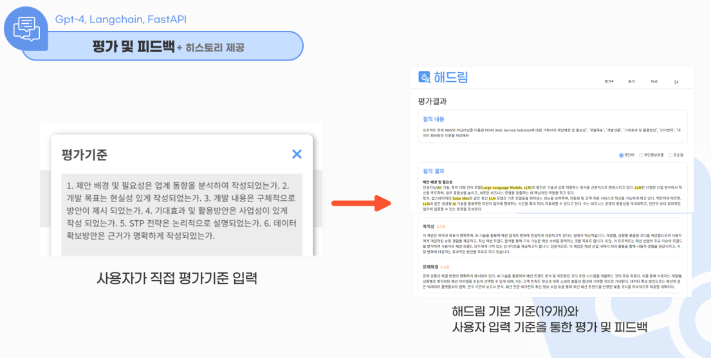

# 꾸준히 역량을 올리는 개발자

## Introduce

### Attitude

- 새로운 기술이나 도전에 대한 끊임없는 호기심과 탐구 정신과 긍정적인 마인드
- 문제 해결을 위한 논리적 접근 방식

 

## Stack

**[FrontEnd]**

    

**[BackEnd]**

      

**[ETC]**

  
   

## Project

- [2024.03.15 ~ 2024.04.15] **교육기관용 프로젝트 기획서 생성 LLM 서비스 <써드림>**
  - 예시 사진 : 
  - 소개 링크 : [써드림](https://github.com/Gosegu2024/Surdream)
  - 맡은 역할 : 모든 웹페이지 제작 (html,css,js), Chart.js를 이용한 그래프 제작, springboot 백엔드 연결(thymeleaf 사용),mongodb 연동, 써드림 아웃풋 비동기 처리(python), aws와 docker를 통한 프로젝트 배포  
- [2024.03.15 ~ 2024.04.15] **웹사이트 기반 작문 LLM 서비스 평가•개선도구 <해드림>**
  - 예시 사진 : 
  - 소개 링크 : [해드림](https://github.com/Gosegu2024/Haedream)
  - 맡은 역할 : 모든 웹페이지 제작 (html,css,js), Chart.js를 이용한 그래프 제작, springboot 백엔드 연결(thymeleaf 사용),mongodb 연동, springboot 백엔드 연결, 써드림 아웃풋 비동기 처리(python), aws와 docker를 통한 프로젝트 배포  
- [2023.12.18 ~ 2024.01.24] **사용자 성향 조사 데이터를 활용한 혼행족을 겨냥한 여행 동행자 서비스**
  - 소개 링크 : [위드어스](https://github.com/2023-SMHRD-IS-AI1/WithusRepo)
  - 맡은 역할 : 모든 웹페이지 제작 (html,css,js), 자바스크립트 웹소켓을 이용한 채팅 기능 구현, 발표 ppt 제작, 발표  
     

## 보유 자격증

- 웹디자인 기능사
