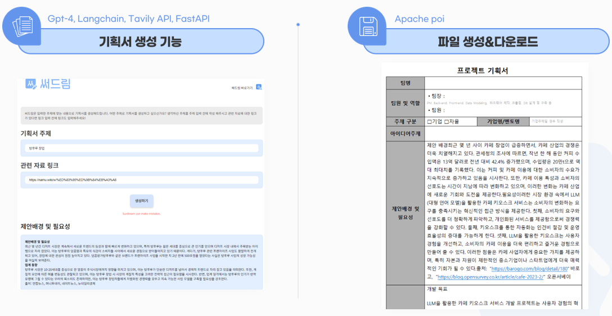
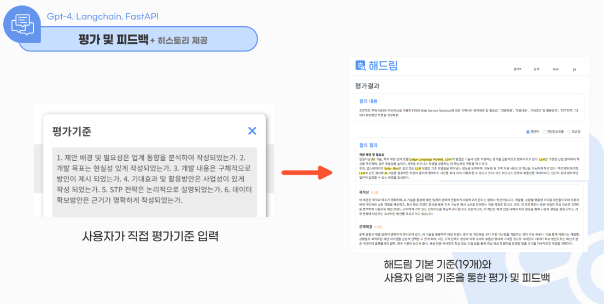

# 꾸준히 역량을 올리는 개발자
## Introduce
⭐ **다른 언어에 비해 더 유연하고 자유로운 자바스크립트에 매료된 개발자입니다.**

1. Knowledge
   - 다양한 자바스크립트 프레임워크 및 라이브러리에 대한 이해력이 높고 Vanilla JS, Node.js, React, Vue.js 등과 같은 주요 기술에 대한 지식 보유
  
2. Skills
   - 자바스크립트를 활용한 다양한 웹 개발
   - 문제 해결을 위한 논리적 접근 방식

3. Attitude
   - 새로운 기술이나 도전에 대한 끊임없는 호기심과 탐구 정신과 긍정적인 마인드
   
## Stack
**[FrontEnd]**

     

**[BackEnd]**

    

**[ETC]**

 
   
## Project

- [2024.03.15 ~ 2024.04.15] **교육기관용 프로젝트 기획서 생성 LLM 서비스 <써드림>**
   - 예시 사진 : 
   - 소개 링크 : [써드림](https://github.com/Gosegu2024/Surdream)   
- [2024.03.15 ~ 2024.04.15] **웹사이트 기반 작문 LLM 서비스 평가•개선도구 <해드림>**
   - 예시 사진 : 
   - 소개 링크 : [써드림]   
   
## 보유 자격증

- 웹디자인 기능사 

